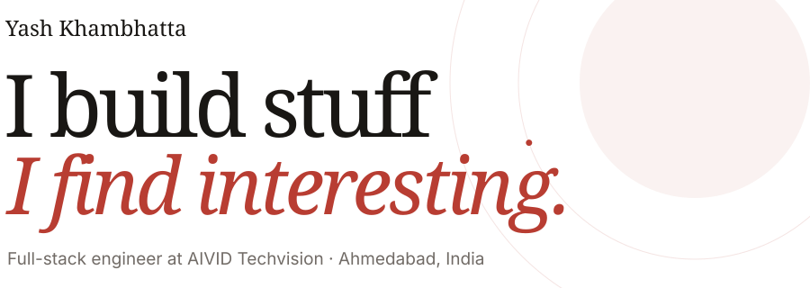
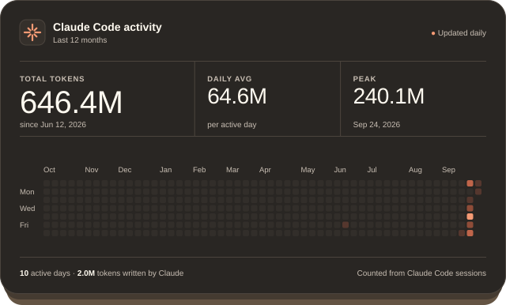

<picture>
  <source media="(prefers-color-scheme: dark)" srcset="assets/hero-dark.svg">
  
</picture>

 
 

 
 

 
 

[yash456k.com](https://www.yash456k.com) · [x.com/yash654k](https://x.com/yash654k) · yashkhambhattak@gmail.com

